# Daemon Master-Worker 架构方案

## 文档结论

本方案需要覆盖的三个核心场景，当前已经全部纳入统一模型，但旧版文档的描述位置较分散：

| 场景 | 结论 | 在本版中的显式位置 |
| --- | --- | --- |
| 1. 四个项目，其中两个 Rust、一个 TS、一个 Go，启动四个客户端 | 已覆盖 | “场景 A：四项目四客户端并发” |
| 2. 同一个项目打开多个客户端 | 已覆盖 | “场景 B：同项目多客户端” |
| 3. 一个项目使用多语言开发 | 已覆盖 | “场景 C：单项目多语言开发” |

这次重组后的文档目标是把方案主线固定为：

1. 先明确要解决的问题。
2. 再明确统一的进程与所有权模型。
3. 然后逐个验证三个关键场景。
4. 最后给出共享边界、运行流程和实施顺序。

## 实施状态（2026-03-17）

当前实现状态已对齐实施计划到 P8 的验证收尾阶段，关键验证入口如下：

- 场景 A-G 集成矩阵：`packages/opencode/src/__tests__/daemon-scenario-matrix.test.ts`
- Z/W/L/M/D gate 汇总：`packages/opencode/src/__tests__/daemon-p8-gates.test.ts`
- S-Gate（serve attach 语义）：`packages/opencode/src/__tests__/serve-command.test.ts`
- D-Gate（daemon diagnostics）：`packages/opencode/src/__tests__/daemon-info-service.test.ts`
- 单文件自举验证：`packages/opencode/src/__tests__/daemon-single-file-bootstrap.test.ts`
- TUI/attach 兼容验证：`packages/opencode/src/__tests__/daemon-tui-attach-compatibility.test.ts`

推荐回归命令（在 `packages/opencode` 目录执行）：

- `bun run test:daemon-p8`
- `bun run tsgo --noEmit`

## 目标

这份方案围绕四个结果展开：

1. 让 server 启动足够轻，只在本地命名空间内保留一个 singleton master。
2. 让项目级重资源只按项目持有一次，而不是按客户端重复初始化。
3. 让客户端执行态彼此隔离，即使它们共享同一个项目 worker。
4. 让多语言、多项目并发时，资源共享只发生在安全边界之上。

## 当前问题

### 1. 控制面与项目面没有真正分离

当前多个入口最终仍会走到项目 bootstrap：

- `packages/opencode/src/server/server.ts`
- `packages/opencode/src/control-plane/workspace-server/server.ts`
- `packages/opencode/src/cli/bootstrap.ts`
- `packages/opencode/src/cli/cmd/tui/worker.ts`

结果是：本应只负责路由、attach、代理的进程，仍可能成为项目资源的实际持有者。

### 2. 项目状态虽然按 key 隔离，但仍共存在同一进程中

当前的基础抽象并不差：

- `packages/opencode/src/project/instance.ts`
- `packages/opencode/src/project/state.ts`

问题不在于“能不能按目录区分状态”，而在于“这些状态最终是不是仍然堆在一个长生命周期进程里”。逻辑隔离不等于进程级隔离。

### 3. 重资源仍然与 instance 启动强耦合

`InstanceBootstrap()` 仍会初始化或注册这些项目级资源：

- plugin hooks
- LSP clients 和 spawn 元数据
- 文件监听器
- file/VCS 辅助能力
- snapshots
- truncation state
- embedding 后台服务注册

相关代码：

- `packages/opencode/src/project/bootstrap.ts`
- `packages/opencode/src/lsp/index.ts`
- `packages/opencode/src/file/watcher.ts`
- `packages/opencode/src/plugin/index.ts`
- `packages/opencode/src/ai/rag/embedding-bg-service.ts`

这说明当前的根问题不是“有没有做惰性加载”，而是“资源所有权没有被正确收口”。

## 统一架构模型

### 1. 进程层级

目标运行时拓扑固定为五层：

1. `opencode-master`
2. `opencode-project-worker:<projectID>`
3. `client-lane:<clientID>`
4. `toolchain-cell:<projectID>:<root>:<language>:<envFingerprint>`
5. 各语言相关原生子进程，例如 LSP、formatter、debug/build helpers

对应职责如下：

- master 持有全局控制面与全局共享产物。
- project worker 持有单项目共享状态。
- client lane 持有单客户端独占执行状态。
- toolchain cell 持有单项目内、单语言或单工具链范围的共享基础设施。

### 2. 控制面与数据面分离

控制面只承载“谁来执行、进程如何管理、系统当前是否健康”的元数据。

允许进入控制面的流量：

- master 发现与附着
- worker 启停、drain、restart
- lease 获取与释放
- workspace 到 project 的解析
- health、heartbeat、readiness、backpressure
- 内存预算、淘汰与恢复决策

禁止进入控制面的流量：

- prompt history
- 文件体和 patch body
- embedding arrays
- semantic chunks
- 大体积 tool 输出

数据面只承载已完成路由决策后的业务负载：

- session prompt 和流式输出
- file read/patch
- PTY 字节流
- retrieval 请求与结果
- tool 调用输入输出
- worker 到 AI runtime 的 inference 负载

### 3. Singleton server 规则

每个 user-profile namespace 内，只允许存在一个 master server。

启动规则固定为：

1. 客户端先查询本地 `ServerRegistry`。
2. 如果 registry 指向健康 master，则直接 attach。
3. 如果没有健康 master，则参与 `ServerBootstrapLock` 选举。
4. 只有锁获胜者允许启动 master。
5. 其他客户端等待 master ready 后附着。

因此，客户端启动不再等于 server 启动，而是 `discover-or-attach`。

#### Fencing 与世代号规则

为了避免 master 选举中的脑裂，singleton 规则还必须引入 `startupEpoch` 或等价的 fencing token。

强制规则：

- 每次成功启动 master，都必须生成新的递增世代号
- `ServerRegistry` 中的 endpoint、worker 注册和 lease 恢复都必须带上该世代号
- 客户端和 worker 只能接受不早于自己已知世代号的控制面指令
- 如果旧 master 在新 master 产生后恢复响应，它也必须因为 epoch 落后而被视为 stale

这意味着：

- 锁只负责“谁可以启动”
- epoch 负责“谁的控制权有效”

两者缺一不可。

#### Orphan adoption 与 watchdog 规则

master 和 worker 之间还必须定义 fate-sharing 规则，避免 master 异常退出后留下孤儿 worker、LSP、PTY 和 toolchain 子进程。

强制规则：

- worker 必须周期性校验其父 master 的 pid、socket 或 heartbeat
- 如果 master 消失且在宽限期内没有新 master 接管，则 worker 进入 `draining -> terminated`
- 新 master 启动后，必须先执行 orphan scan，决定是 `adopt` 还是 `reap + respawn`
- orphan adoption 也必须受 epoch 约束，禁止旧 worker 被旧 epoch 重新接管

### 4. 项目 worker 规则

每个 canonical project 只允许有一个 project worker。

project worker 负责持有：

- 该项目唯一的 `Instance` 上下文
- 一次性的 `InstanceBootstrap()` 生命周期
- LSP pool
- 文件监听图
- VCS 和 snapshot 状态
- project memory
- vector index
- knowledge graph
- toolchain cell registry

这个边界决定了：同项目的多个客户端可以复用同一个 worker，不同项目绝不能复用一个 worker。

### 5. Client lane 规则

每个附着客户端在目标项目下都必须拥有一条独占执行通道。

client lane 持有：

- prompt orchestration state
- token streaming state
- approval state
- session-local PTY 生命周期
- abort/retry tree
- 临时 task state

这意味着正确模型不是“一个客户端一个 server”，而是“一个客户端在一个项目下有一条独占 lane”。

#### Worker 内的资源仲裁规则

lane 隔离并不意味着 lane 可以绕过 worker 直接争用共享资源。

worker 还必须对以下资源提供显式仲裁：

- 文件写入与 patch 应用
- VCS 写操作与 index/lock 竞争
- build/test/debug 任务槽位
- PTY 或端口类独占资源

建议引入 worker 级资源锁或仲裁器：

- `FileWriteLock`
- `VcsOperationLock`
- `TaskExecutionLock`
- `PortOrPtyReservation`

规则：

- lane 是请求者，不是共享资源最终所有者
- 资源冲突由 worker 控制面仲裁，而不是由 lane 直接竞争
- 被拒绝或排队的 lane 必须获得显式 backpressure 或 busy 响应

### 6. Toolchain cell 规则

在每个 project worker 内，再按语言或工具链拆成 toolchain cell。

建议标识：

- `toolchainCellID = projectID + root + language + envFingerprint`

每个 toolchain cell 可以持有：

- 一个或多个 LSP server
- formatter/diagnostic 子进程
- 语言特定 symbol/index 辅助进程
- 环境激活元数据

核心规则：

- toolchain cell 是 project 级共享，不是 client 级共享。
- toolchain cell 永远不能跨 project 复用。
- 同一个 project worker 可以同时持有多个 toolchain cell。

## 场景覆盖审查

### 场景 A：四项目四客户端并发

场景定义：

- 项目 A：Rust
- 项目 B：Rust
- 项目 C：TypeScript
- 项目 D：Go
- 客户端 1 连接 A
- 客户端 2 连接 B
- 客户端 3 连接 C
- 客户端 4 连接 D

正确拓扑是：

- 1 个 singleton master
- 4 个 project worker
- 4 个 client lane
- 4 个主 toolchain cell

对应关系应为：

- `projectA` worker
  - `client1` lane
  - `toolchain:projectA:rust`
- `projectB` worker
  - `client2` lane
  - `toolchain:projectB:rust`
- `projectC` worker
  - `client3` lane
  - `toolchain:projectC:typescript`
- `projectD` worker
  - `client4` lane
  - `toolchain:projectD:go`

结论：这个场景已经被覆盖，而且必须明确保持“两份 Rust 项目 = 两个 Rust cell”，不能因为语言相同而共用分析状态。

### 场景 B：同项目多客户端

场景定义：

- 一个项目 P
- 同时打开多个 TUI、attach CLI 或其他本地客户端

正确拓扑是：

- 1 个 singleton master
- 1 个 `project-worker:P`
- N 个 client lane
- 1 个或多个 toolchain cell，取决于项目语言组成

共享边界：

- 可共享：LSP pool、watcher、snapshot、VCS 状态、project memory、vector index、knowledge graph
- 不可共享：prompt 执行态、审批队列、PTY 所有权、abort/retry 链、在途 tool 状态

结论：这个场景原本已被“项目与客户端的 1:1 执行模型”覆盖，但旧版文档没有把它单独提升为显式场景。现在已单独收口。

### 场景 C：单项目多语言开发

场景定义：

- 一个 canonical project
- 项目内部可能同时包含 TypeScript、Go、Python、Rust、Java 或其他子根
- 单个客户端可能跨多个语言子域执行任务

正确拓扑是：

- 1 个 `project-worker`
- 多个 `toolchain-cell`
- 每个 client lane 可按需访问多个 cell

例如一个 monorepo 可以同时持有：

- `toolchain:frontend:typescript`
- `toolchain:backend:go`
- `toolchain:services:python`
- `toolchain:infra:nix`

结论：这个场景原本分散在“多语言项目规则”和“Monorepo 与多语言支持”两处，现在合并为单独的显式场景。

## 建议继续细化的附加场景

除了上面三个必须覆盖的主场景，还建议继续细化以下几个高价值场景。

### 场景 D：同一仓库的多个 worktree 或多个分支并发打开

场景定义：

- 同一个 git common dir
- 不同的 worktree root 或不同分支 checkout
- 多个客户端分别附着到这些 worktree

这里最容易出错的点是 project identity 归一化。

如果归一化只看仓库来源，而不看 worktree root，就会错误共享以下状态：

- watcher graph
- LSP root 和诊断结果
- snapshot 与 VCS 状态
- build 输出与环境基线

因此建议补充明确规则：

- `canonical project identity` 必须包含 worktree root 维度
- 同仓库不同 worktree 默认视为不同 project worker
- 允许共享全局产物，但绝不能共享项目运行态

### 场景 E：master 或 worker 崩溃后的客户端重连与恢复

场景定义：

- master 已存在，多个客户端已 attach
- 某个 worker 崩溃，或者 master 崩溃
- 客户端需要自动恢复，而不是要求用户手动重启全部界面

这个场景需要进一步明确：

- stale registry 的判定条件
- client lease 的失效与重建流程
- client lane 是否允许 resume，还是只能重建
- worker 崩溃后 project 级共享状态如何恢复
- master 崩溃后 attach 客户端如何重新发现新实例

这是把“故障域”从概念变成可执行恢复策略的关键场景。

### 场景 F：内存压力下的多项目淘汰与抢占

场景定义：

- 同时存在多个 hot worker 和 warm-idle worker
- AI runtime 也占用较多 native/GPU 内存
- 新项目进入时，需要触发 budget shedding

这个场景需要进一步明确：

- warm-idle worker 的淘汰优先级
- hot worker 在何种压力阈值下允许降级
- toolchain cell 是否可单独回收，而不杀整个 worker
- AI runtime 模型常驻池的缩容顺序
- 回收动作对 attach 客户端的可见语义

否则内存预算章节仍然偏原则，缺少真正可实现的仲裁规则。

### 场景 G：本地 control socket 与 public HTTP listener 并存

场景定义：

- 已有多个本地客户端通过 control socket attach
- 用户又显式开启 `serve`、`web` 或 expose 模式

这个场景需要明确的约束是：

- 仍然只能有一个 singleton master
- public HTTP listener 只是同一个 master 的附加表面，不是第二个 server
- public listener 的生命周期不能破坏已有本地 attach 会话
- 对外网络入口故障不能影响本地 control plane 的基本可用性

这个场景对“内部单实例、外部可选暴露”的一致性很重要。

## 场景状态机与时序图

下面把场景 A 到 G 全部下沉到“状态机 + 时序图”级别，目的是把抽象边界变成可实现的运行规则。

### 场景 A：四项目四客户端并发

状态机：

- `client`: `discovering -> attached -> leased -> active -> released`
- `project-worker`: `cold -> starting -> hot -> warm-idle -> terminated`
- `toolchain-cell`: `cold -> ready -> busy -> idle -> recycled`
- `ai-runtime`: `cold -> ready -> serving -> throttled`

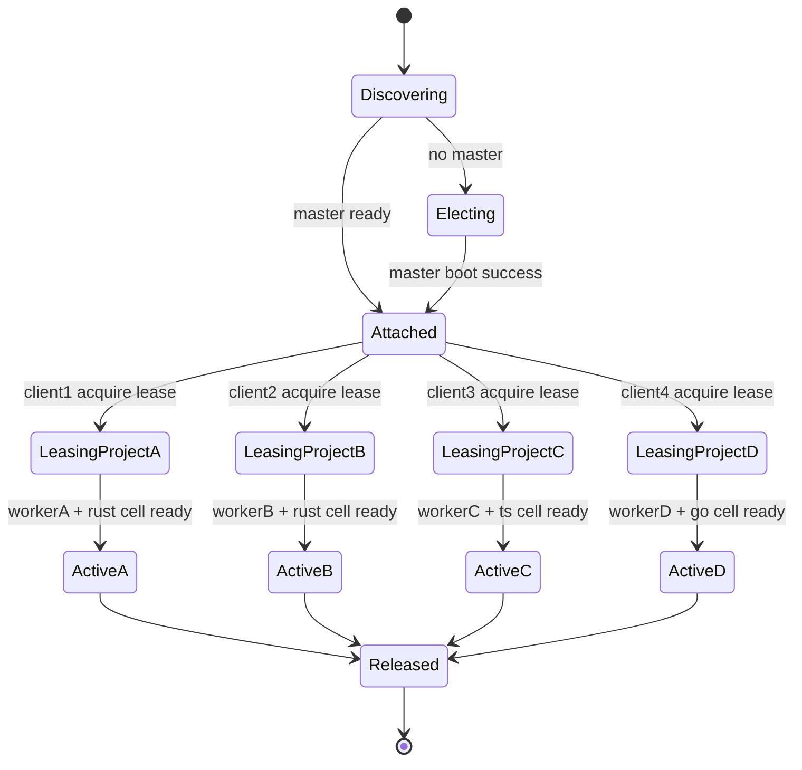

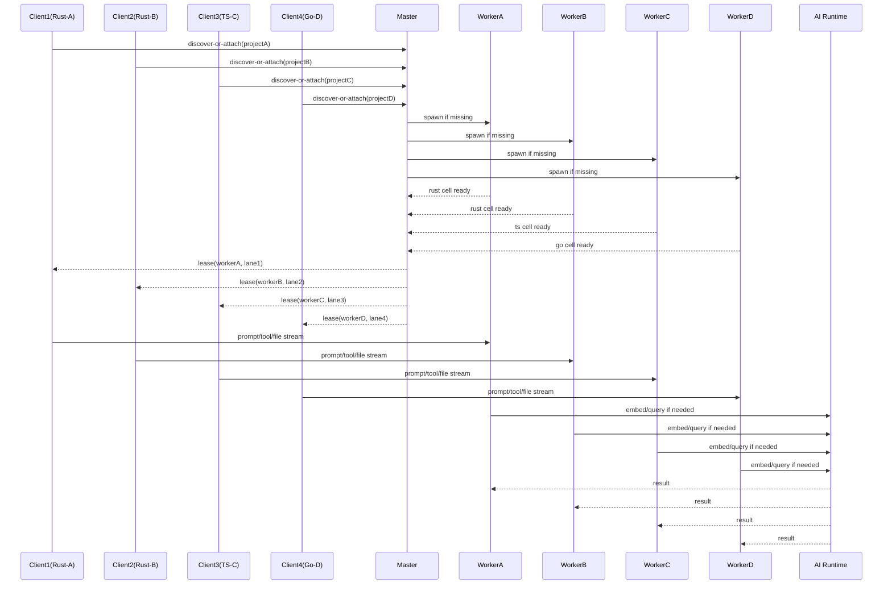

实现含义：

- Rust A 与 Rust B 可以共享 Rust 产物，但不能共享 Rust 分析进程状态。
- 四个 client lane 必须互相独立，即使它们共享同一个 AI runtime。

### 场景 B：同项目多客户端

状态机：

- `project-worker:P`: `cold -> starting -> shared-hot -> shared-idle -> draining -> terminated`
- `client-lane`: `created -> attached -> active -> idle -> released`

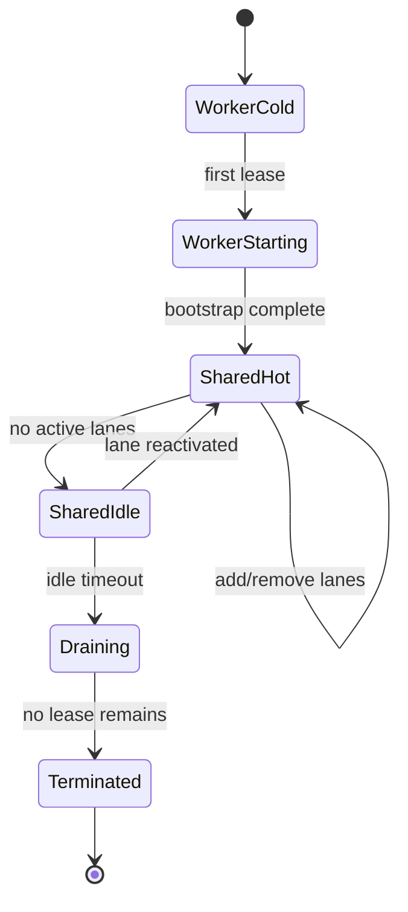

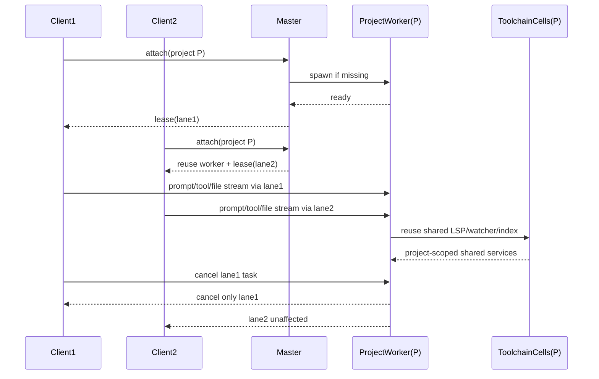

实现含义：

- 同项目多客户端的共享边界必须停在 project worker 和 toolchain cell。
- 一条 lane 的 cancel、crash、approval 不得污染其他 lane。

### 场景 C：单项目多语言开发

状态机：

- `project-worker`: `starting -> ready -> multi-cell-active -> idle`
- `toolchain-cell`: `cold -> resolving-env -> ready -> busy -> idle -> recycled`

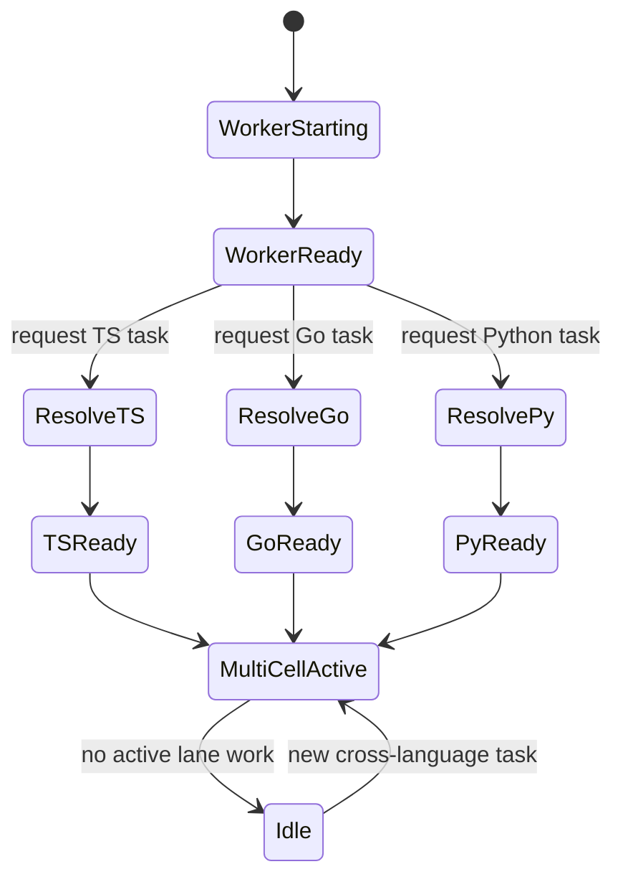

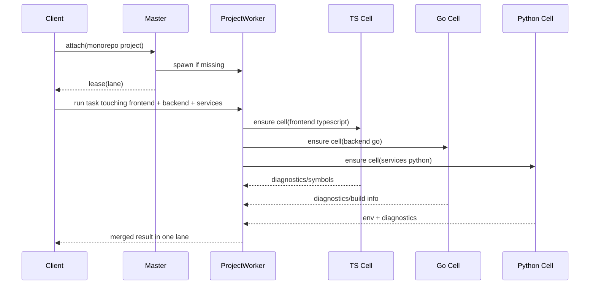

实现含义：

- 一个 client lane 可以跨多个 toolchain cell 协同。
- 但 cell 仍属于 project worker，不能跨项目漂移复用。

### 场景 D：同仓库多个 worktree 或分支并发

状态机：

- `identity-resolution`: `input-path -> canonicalize -> compare-worktree-root -> allocate-projectID`
- `project-worker`: `missing -> spawned-per-worktree -> active`

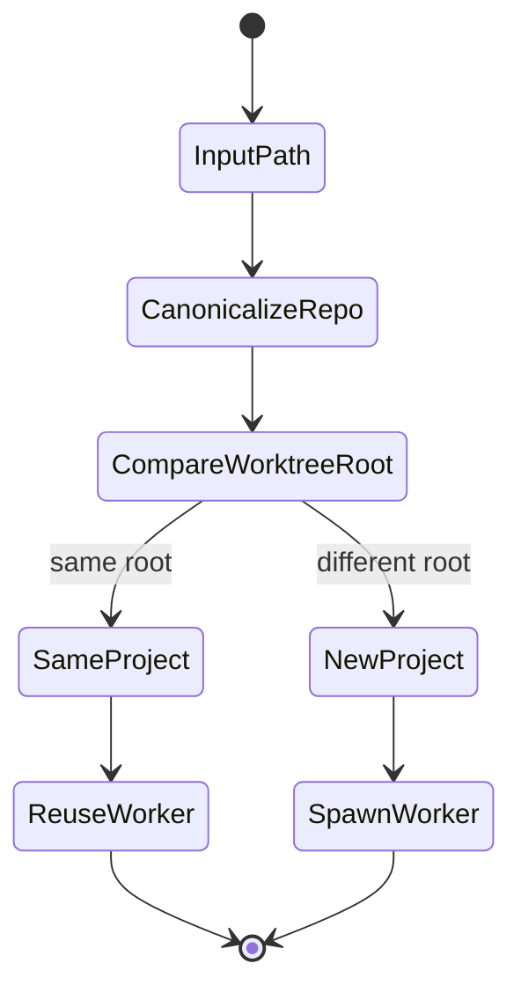

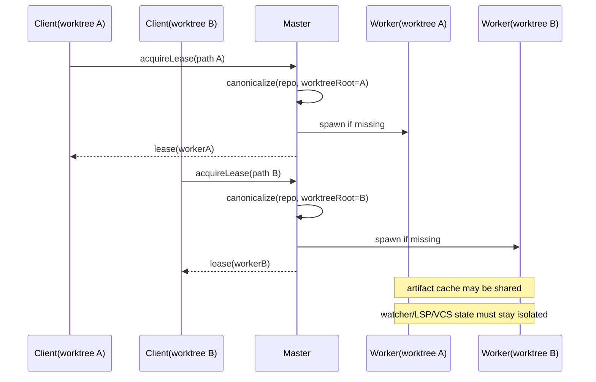

实现含义：

- `canonical project identity` 必须带上 worktree root。
- 同 repo 不同 worktree 默认分配不同 worker。

### 场景 E：master 或 worker 崩溃后的客户端重连与恢复

状态机：

- `master`: `ready -> unhealthy -> stale -> re-elected -> ready`
- `worker`: `hot -> crashed -> respawning -> recovered`
- `client-lane`: `active -> reconnecting -> reattached | rebuilt`

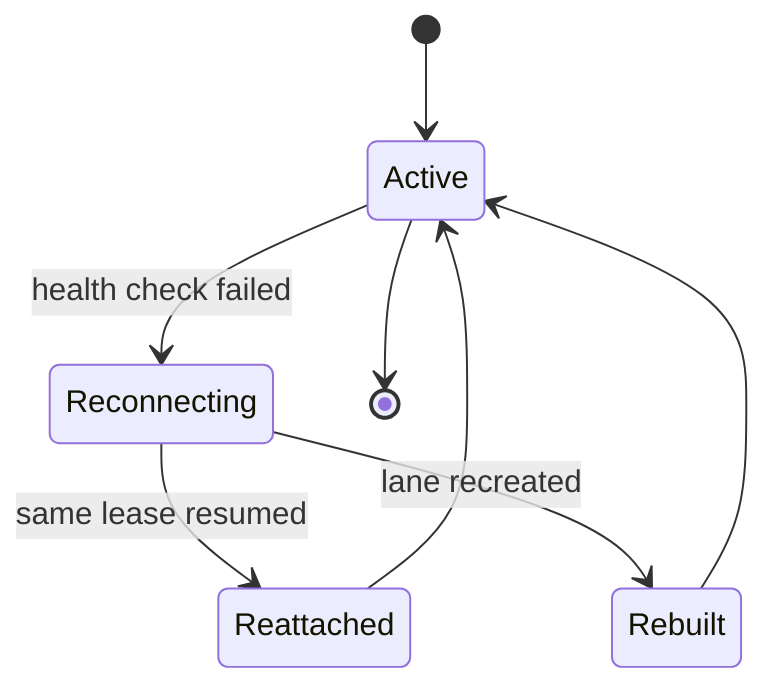

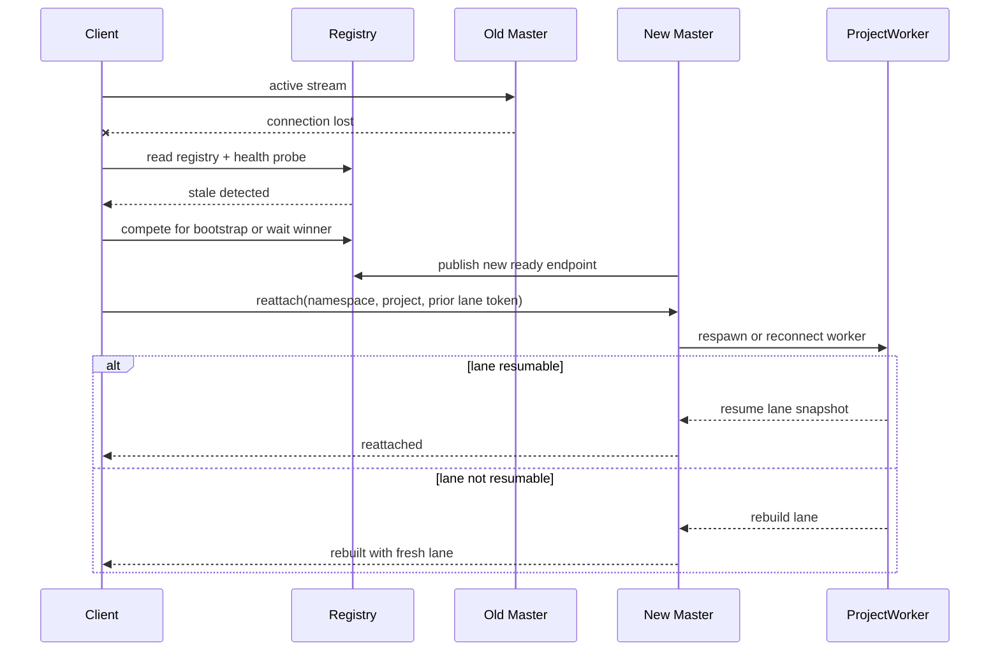

实现含义：

- master 恢复和 worker 恢复必须是两条不同恢复路径。
- lane 允许 `resume` 还是只能 `rebuild`，必须在协议里显式定义。

### 场景 F：内存压力下的多项目淘汰与抢占

状态机：

- `budget`: `healthy -> pressured -> shedding -> stabilized`
- `worker`: `warm-idle -> draining -> terminated`
- `toolchain-cell`: `idle -> suspended -> recycled`

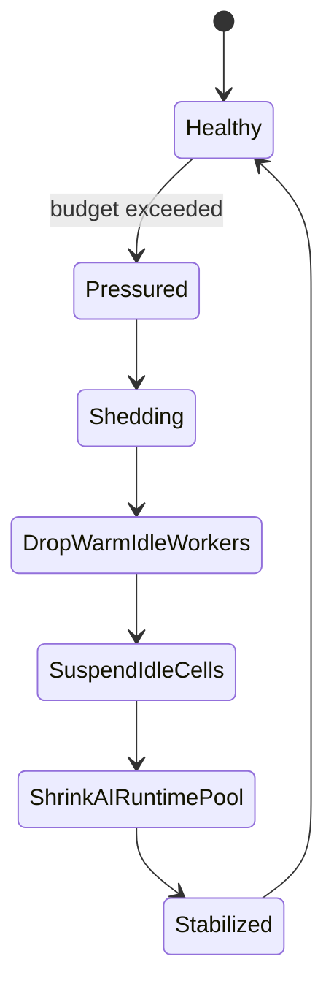

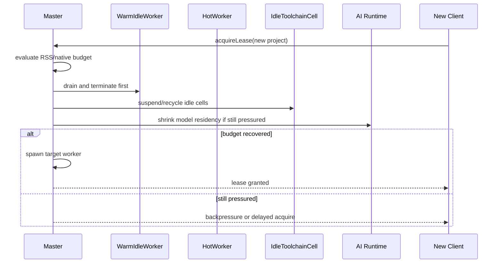

实现含义：

- 淘汰顺序必须固定，先 warm-idle，再 idle cell，再 AI runtime 池。
- 不能为了新项目直接杀死仍在活跃中的 client lane。

### 场景 G：local control socket 与 public HTTP listener 并存

状态机：

- `master-surface`: `socket-only -> socket+public-http -> socket-only`
- `attach-clients`: `attached -> unaffected`

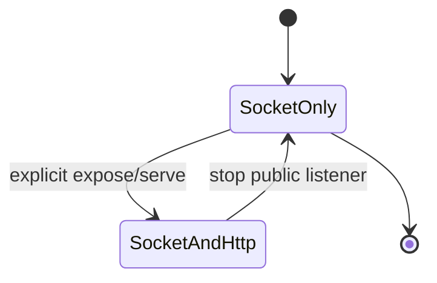

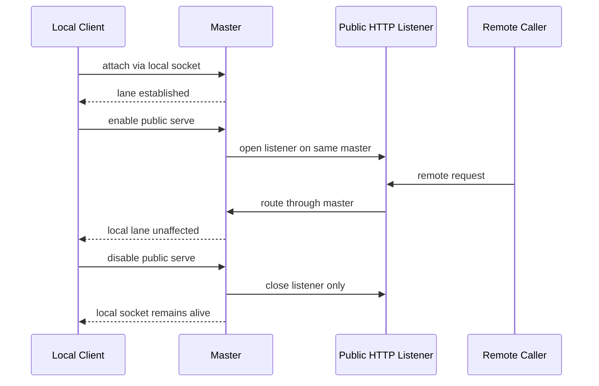

实现含义：

- public listener 只是 master 的附加 surface。
- public surface 的打开与关闭不能重建 master，更不能中断本地 socket attach。

## 打包与交付约束

架构引入 master、worker、client lane、AI runtime sidecar 之后，必须明确一个非功能性约束：

- 运行时可以是多进程。
- 但交付物仍然应保持单文件打包，便于安装、替换、分发和手工使用。

这意味着：

- 面向用户分发的仍然是单个 `opencoded` 可执行文件
- `opencode-master`、`project-worker`、`ai-runtime` 都应是同一二进制的不同运行模式，而不是额外要求用户安装多个 helper 二进制
- 当前单文件构建方式必须继续成立，例如 `packages/opencode/script/build.ts --single`

### 单文件打包下的进程模型约束

为了满足单文件交付，运行时应采用“同一二进制自举多进程”的方式。

建议模型：

- 用户执行主入口：`opencoded`
- master 需要拉起 worker 时，重新执行同一二进制，并传入内部模式参数
- AI runtime sidecar 如需独立进程，也应通过同一二进制自启动，而不是依赖额外可执行文件

例如内部上可以是类似这样的模式：

- `opencoded internal master`
- `opencoded internal worker --project <id>`
- `opencoded internal ai-runtime`

具体参数形式可以调整，但原则不能变：同一个已打包二进制完成所有角色。

### 单文件打包下不能退化成什么形态

以下形态应明确禁止：

- 要求用户另外安装 `opencode-master`、`opencode-worker` 等多个独立二进制
- 依赖未打包的 JS 入口文件在运行时再去拉 worker
- 要求用户手动维护多个 companion 可执行文件
- 因为引入 sidecar 而把 CLI/daemon 的基本使用变成多文件部署

允许存在的仅应是运行时状态文件，例如：

- registry
- socket 或 named pipe
- log
- cache
- models/artifacts

但这些都不是用户需要手动管理的分发工件。

### 单文件打包对实现的直接影响

这个约束会直接影响实现方式：

- master/worker/ai-runtime 的入口拆分必须发生在同一二进制内部
- IPC 协议不能依赖“不同可执行文件之间版本恰好匹配”的假设
- 自举逻辑必须能基于当前可执行文件路径稳定地重新拉起自身
- 任何新的 control-plane 或 sidecar 设计，都必须先回答“是否仍然能保留单文件分发”

因此，“运行时多进程”是架构手段，“交付仍是单文件”是产品约束，两者必须同时成立。

## 资源共享策略

### 全局可共享资源

只能由 master 或共享 sidecar 持有一次的资源：

- 模块安装与 native 包落地
- 模型下载缓存与模型元数据
- tree-sitter parser/runtime 静态资源
- 全局 config、auth、provider 元数据
- 进程级 metrics、health、memory accounting
- AI runtime 中的模型权重和 GPU/WebGPU 上下文

这些资源可以跨项目共享，但不能持有项目绑定状态。

### 项目内可共享资源

只能在同一 project worker 内共享的资源：

- LSP client pool
- 文件监听器
- VCS 和 snapshot 状态
- project memory snapshot
- vector index
- knowledge graph
- toolchain cell registry
- 环境基线快照

这些资源按项目隔离，不得跨项目复用。

### 客户端本地资源

只能在 client lane 内持有的资源：

- prompt orchestration
- token 流输出归属
- approval state
- session-local PTY
- abort/retry state
- 临时 tool/task 状态

这些资源随客户端结束而释放，不得提升为 project 级共享状态。

### 可共享但必须强隔离请求的运行时

这类资源收益高，但必须只共享引擎，不共享业务数据：

- embedding runtime
- GPU/WebGPU adapter 所有权
- 未来的 reranker/runtime pool

因此它们应放在 `opencode-ai-runtime` sidecar 中，由 worker 发送负载并接收结果，而不是由 worker 持有模型权重。

## 三个场景下的共享与非共享边界

### 跨项目可以共享什么

- singleton master 控制面
- `ServerRegistry` 和 `ServerBootstrapLock`
- 模块与模型产物缓存
- tree-sitter 语言包与 parser 资源
- AI runtime sidecar
- 全局二进制产物，例如 `rust-analyzer` 可执行文件本体

### 跨项目绝不能共享什么

- language server 进程实例
- Cargo/go.mod/tsconfig/Python env 解析结果
- 项目环境快照
- watcher graph
- project memory
- vector index
- knowledge graph
- VCS state cache

### 同项目多客户端绝不能共享什么

- prompt context
- active PTY ownership
- pending approval
- cancel/retry chain
- client-local task graph

### 为什么两个 Rust 项目必须保留两个 Rust cell

因为以下维度通常并不相同：

- workspace members
- Cargo features
- target 目录内容
- `rust-toolchain` 版本
- 环境变量覆盖
- build script 和生成代码

所以正确规则只能是：

- Rust 产物全局共享
- Rust 分析进程按项目隔离

这个规则同样适用于 TypeScript、Go、Python、Java 等语言。

## 运行流程

### 1. 客户端启动流程

1. 客户端查询 `ServerRegistry`。
2. 若 master 健康，则直接 attach。
3. 若 master 缺失，则参与 `ServerBootstrapLock` 选举。
4. 选举获胜者启动 master。
5. 其余客户端等待 ready 信号后 attach。

### 2. 项目 lease 获取流程

1. 客户端连接 master。
2. master 根据目录或 worktree 解析 canonical project identity。
3. master 返回已有 worker lease，或启动新的 worker。
4. worker 为该客户端分配独占 client lane。
5. worker 按需解析并激活所需 toolchain cell。

### 3. 控制面通道

建议显式保留独立 `control rpc`：

- client <-> master
- master <-> worker
- master <-> ai runtime

只允许小型元数据消息：

- lease acquire/release
- worker stats
- runtime status
- health/backpressure
- route token 和 endpoint 元数据

### 4. 数据面通道

建议保留两条数据流：

1. `project data stream`
   - client <-> project worker
   - 承载 session/file/tool/PTY 等业务流量

2. `ai inference stream`
   - project worker <-> ai runtime
   - 承载 embedding 和模型推理负载

原则是：master 在完成路由后尽快退出数据路径。

### 5. Workspace 请求流

`workspace-serve` 不应再直接创建项目状态，而应改为：

1. 由 master 处理 workspace 注册和 fanout。
2. workspace identity 映射到已有 project worker，再叠加 workspace lease。
3. 项目相关 session API 仍由 worker 承担。
4. heartbeat、连接生命周期和 worker 发现由 master 承担。

## 生命周期、隔离和恢复

### Worker 状态

- `cold`
- `starting`
- `hot`
- `warm-idle`
- `draining`
- `terminated`

### Client lane 状态

- `created`
- `attached`
- `active`
- `idle`
- `draining`
- `released`

### 空闲策略

采用“分阶段卸载”，而不是直接 kill：

1. 停止不活跃文件监听器。
2. 停止空闲 LSP clients。
3. 刷盘 vector/project-memory snapshot。
4. 丢弃 worker 本地缓存。
5. 若所有 lease 已释放且超时，则终止 worker。

### 隔离级别

建议支持三档：

- `shared-project`
  - 默认模式，共享 worker，隔离 client lane
- `strict-client`
  - 独占 client lane，并独占 PTY/debug/build 子进程所有权
- `strict-worker`
  - 为单个 client 分配独占 worker，用更高内存换更强隔离

### 环境隔离

每个 project worker 必须持有自己的不可变环境快照，包括：

- canonical worktree
- PATH 视图
- toolchain binaries
- Python virtualenv/conda 元数据
- Node/Bun/Deno package manager 元数据
- cargo/go/maven/gradle 根标记
- 必要的环境变量覆盖项

client lane 只能继承这个快照，不能改写项目级基线。

### 故障域与重启策略

建议规则：

- LSP 崩溃：只重启对应 toolchain cell
- build/test shell 崩溃：只失败所属 client lane
- project worker 崩溃：由 master 接管客户端并重建项目平面
- master 崩溃：通过 registry 和选举执行 singleton 恢复

因此：

- 同项目多客户端时，一个 lane 崩溃不应拖垮整个 worker
- 四项目并发时，Go cell 崩溃不应影响 Rust 或 TS 项目

## API 与实现轮廓

这一节的目标不是再描述概念，而是把概念压缩成可实现的接口和协议边界。

### 设计原则

接口设计必须满足以下约束：

1. 保留当前 `Project.Info.id` 这类稳定项目标识的价值。
2. 新增一个能区分 worktree 的运行时实例键，避免错误复用 worker。
3. 所有角色都必须能从同一个 `opencoded` 单文件二进制自举出来。
4. control-plane 与 data-plane 必须在类型层面就分开，不能只靠约定。
5. 对当前 TUI 内部传输层保持兼容，避免直接打断 `http://opencode.internal` 适配路径。

### 标识模型

首先需要把“稳定项目身份”和“运行时实例身份”拆开。

当前仓库里 `ProjectID` 更适合作为稳定的仓库级身份，例如同一 git common dir 下可共享历史归档、项目展示信息或长期统计。 
但 worker 归属不能只看这个 ID，因为同 repo 不同 worktree 必须落到不同运行实例。

建议新增以下类型：

```ts
type NamespaceID = string
type StartupEpoch = string
type ProjectRuntimeKey = string
type WorkerID = string
type ClientID = string
type LaneID = string
type ToolchainCellID = string
type LeaseToken = string
type ResumeToken = string
type ProtocolVersion = 1

interface ProjectRepositoryIdentity {
  projectID: ProjectID
  gitCommonDir?: string
  vcs: "git" | "none"
}

interface ProjectRuntimeIdentity {
  namespace: NamespaceID
  projectID: ProjectID
  sandboxRoot: string
  worktreeRoot: string
  workerEnvScope: string
  runtimeKey: ProjectRuntimeKey
}
```

关键规则：

- `projectID` 表示稳定仓库身份。
- `runtimeKey` 表示 worker 实际归属键。
- `runtimeKey` 至少应由 `namespace + projectID + worktreeRoot + workerEnvScope` 组成。
- worker registry、lease registry、toolchain registry 一律按 `runtimeKey` 工作，而不是按裸 `ProjectID` 工作。

这里的 `workerEnvScope` 不是 lane 层面的临时环境，而是会影响项目级共享状态的环境边界，例如：

- dev shell / nix shell 身份
- 项目级 PATH/toolchain 视图
- 会改变项目级构建、索引或语言服务结果的仓库级环境覆盖

而更细粒度、语言专属的环境差异，仍然放在 `ToolchainRuntimeProfile.envFingerprint` 中。

### 运行模式接口

单文件自举要求所有角色由同一二进制派生，因此需要一个统一运行模式定义：

```ts
type RuntimeMode = "cli" | "master" | "worker" | "ai-runtime"

interface ExecutableBootstrapContext {
  mode: RuntimeMode
  binaryPath: string
  argv: string[]
  namespace: NamespaceID
}

interface SelfSpawnRequest {
  mode: Exclude<RuntimeMode, "cli">
  namespace: NamespaceID
  args: string[]
  env: Record<string, string>
}

interface SelfSpawner {
  spawn(request: SelfSpawnRequest): Promise<{ pid: number }>
}
```

实现要求：

- master 拉起 worker 时只能通过 `SelfSpawner` 重启当前二进制。
- AI runtime sidecar 也必须使用同一入口派生。

### Master bootstrap 与注册表接口

```ts
type MasterState = "starting" | "ready" | "draining" | "stopped"

interface ServerRegistryRecord {
  namespace: NamespaceID
  pid: number
  startupEpoch: StartupEpoch
  state: MasterState
  controlEndpoint: string
  publicEndpoint?: string
  protocolVersion: ProtocolVersion
  binaryPath: string
  startedAt: number
  authMode: "none" | "basic"
}

interface BootstrapLockLease {
  namespace: NamespaceID
  holderPID: number
  acquiredAt: number
}

interface ServerRegistryStore {
  read(namespace: NamespaceID): Promise<ServerRegistryRecord | undefined>
  write(record: ServerRegistryRecord): Promise<void>
  clear(namespace: NamespaceID): Promise<void>
}

interface ServerBootstrapLock {
  acquire(namespace: NamespaceID): Promise<BootstrapLockLease | undefined>
  release(lease: BootstrapLockLease): Promise<void>
}

interface MasterDiscoveryService {
  discover(namespace: NamespaceID): Promise<ServerRegistryRecord | undefined>
  isHealthy(record: ServerRegistryRecord): Promise<boolean>
  recoverStale(namespace: NamespaceID, record: ServerRegistryRecord): Promise<void>
}

interface OrphanAdoptionCoordinator {
  scan(namespace: NamespaceID): Promise<Array<{ pid: number; runtimeKey?: ProjectRuntimeKey; startupEpoch?: StartupEpoch }>>
  adopt(input: { pid: number; startupEpoch: StartupEpoch }): Promise<boolean>
  reap(input: { pid: number; reason: string }): Promise<void>
}
```

### Master 控制面接口

```ts
interface AcquireProjectLeaseInput {
  namespace: NamespaceID
  clientID: ClientID
  directory: string
  workspaceID?: string
  isolation: "shared-project" | "strict-client" | "strict-worker"
}

interface AcquireProjectLeaseOutput {
  runtime: ProjectRuntimeIdentity
  workerID: WorkerID
  laneID: LaneID
  leaseToken: LeaseToken
  projectDataEndpoint: string
  resumeToken?: ResumeToken
}

interface MasterControlApi {
  health(): Promise<{ state: MasterState; startupEpoch: StartupEpoch }>
  acquireProjectLease(input: AcquireProjectLeaseInput): Promise<AcquireProjectLeaseOutput>
  releaseProjectLease(input: { leaseToken: LeaseToken }): Promise<void>
  getRuntimeStatus(input?: { runtimeKey?: ProjectRuntimeKey }): Promise<RuntimeStatusSnapshot>
  enablePublicListener(input: { hostname?: string; port?: number; cors?: string[] }): Promise<{ url: string }>
  disablePublicListener(): Promise<void>
}
```

### 项目身份解析接口

这部分应与当前 `Project.fromDirectory()` 对齐，但不要直接复用“只看 `ProjectID`”的语义。

```ts
interface ProjectIdentityResolutionInput {
  namespace: NamespaceID
  directory: string
}

interface ProjectIdentityResolutionOutput {
  repository: ProjectRepositoryIdentity
  runtime: ProjectRuntimeIdentity
}

interface ProjectIdentityResolver {
  resolve(input: ProjectIdentityResolutionInput): Promise<ProjectIdentityResolutionOutput>
}
```

实现要求：

- `projectID` 可继续基于当前仓库规则生成。
- `runtimeKey` 必须加入 worktree root。
- `directory -> sandboxRoot -> worktreeRoot -> projectID -> runtimeKey` 的解析链必须固定。

### Worker 监管与租约接口

```ts
type WorkerState = "cold" | "starting" | "hot" | "warm-idle" | "draining" | "terminated"

interface ProjectWorkerDescriptor {
  workerID: WorkerID
  runtime: ProjectRuntimeIdentity
  state: WorkerState
  pid?: number
  startupEpoch: StartupEpoch
  startedAt?: number
  lastActiveAt?: number
  laneCount: number
  toolchainCellCount: number
}

interface ProjectWorkerLeaseRegistry {
  get(runtimeKey: ProjectRuntimeKey): Promise<ProjectWorkerDescriptor | undefined>
  put(worker: ProjectWorkerDescriptor): Promise<void>
  delete(runtimeKey: ProjectRuntimeKey): Promise<void>
  list(): Promise<ProjectWorkerDescriptor[]>
}

interface WorkerSupervisor {
  ensureWorker(runtime: ProjectRuntimeIdentity): Promise<ProjectWorkerDescriptor>
  markHot(workerID: WorkerID): Promise<void>
  beginDrain(workerID: WorkerID): Promise<void>
  terminate(workerID: WorkerID): Promise<void>
  stats(workerID: WorkerID): Promise<WorkerStats>
}

interface WorkerResourceArbiter {
  acquireFileWrite(input: { workerID: WorkerID; laneID: LaneID; path: string }): Promise<{ granted: boolean; lockID?: string }>
  acquireTaskSlot(input: { workerID: WorkerID; laneID: LaneID; taskKind: string }): Promise<{ granted: boolean; slotID?: string }>
  acquireVcsMutation(input: { workerID: WorkerID; laneID: LaneID }): Promise<{ granted: boolean; lockID?: string }>
  release(lockID: string): Promise<void>
}
```

### Client lane 接口

```ts
type LaneState = "created" | "attached" | "active" | "idle" | "draining" | "released"

interface ClientLaneDescriptor {
  laneID: LaneID
  clientID: ClientID
  runtimeKey: ProjectRuntimeKey
  workerID: WorkerID
  state: LaneState
  isolation: "shared-project" | "strict-client" | "strict-worker"
  leaseToken: LeaseToken
  resumeToken?: ResumeToken
  createdAt: number
  lastActiveAt: number
}

interface AcquireLaneInput {
  workerID: WorkerID
  clientID: ClientID
  isolation: "shared-project" | "strict-client" | "strict-worker"
}

interface LaneController {
  acquire(input: AcquireLaneInput): Promise<ClientLaneDescriptor>
  release(leaseToken: LeaseToken): Promise<void>
  cancel(input: { laneID: LaneID; reason?: string }): Promise<void>
  rebuild(input: { laneID: LaneID }): Promise<ClientLaneDescriptor>
  resume(input: { resumeToken: ResumeToken }): Promise<ClientLaneDescriptor | undefined>
}
```

规则：

- `resumeToken` 只代表“尝试恢复”的能力，不保证一定成功。
- worker 崩溃恢复时，协议必须允许返回 `undefined`，表示需要 `rebuild`。

### Toolchain cell 接口

```ts
type ToolchainKind = "typescript" | "javascript" | "go" | "rust" | "python" | "java" | "deno" | "other"
type ToolchainCellState = "cold" | "resolving-env" | "ready" | "busy" | "idle" | "suspended" | "recycled"

interface ToolchainRuntimeProfile {
  runtimeKey: ProjectRuntimeKey
  root: string
  language: ToolchainKind
  packageManager?: string
  buildSystem?: string
  envFingerprint: string
}

interface ToolchainCellDescriptor {
  cellID: ToolchainCellID
  workerID: WorkerID
  profile: ToolchainRuntimeProfile
  state: ToolchainCellState
  pidGroup?: number[]
  lastUsedAt?: number
}

interface ToolchainCellRegistry {
  ensure(profile: ToolchainRuntimeProfile): Promise<ToolchainCellDescriptor>
  suspend(cellID: ToolchainCellID): Promise<void>
  recycle(cellID: ToolchainCellID): Promise<void>
  list(workerID: WorkerID): Promise<ToolchainCellDescriptor[]>
}
```

### Artifact 与 AI runtime 接口

```ts
type ArtifactKind = "module" | "model" | "parser" | "binary"

interface ArtifactEnsureRequest {
  kind: ArtifactKind
  name: string
  version?: string
  platform?: string
}

interface ArtifactEnsureResult {
  path: string
  cacheHit: boolean
}

interface SharedArtifactRegistry {
  ensure(request: ArtifactEnsureRequest): Promise<ArtifactEnsureResult>
}

interface EmbedRequest {
  model: string
  input: string[]
  dimensions?: number
}

interface EmbedResponse {
  vectors: number[][]
  model: string
}

interface AIRuntimeSupervisor {
  warm(model: string): Promise<void>
  embed(request: EmbedRequest): Promise<EmbedResponse>
  stats(): Promise<AIRuntimeStats>
  shrinkPool(target: { maxResidentModels: number }): Promise<void>
}
```

### IPC Envelope 设计

control-plane 需要统一 envelope，而不是散落的裸 JSON：

```ts
interface ControlEnvelope<TType extends string, TBody> {
  protocolVersion: ProtocolVersion
  requestID: string
  correlationID?: string
  namespace: NamespaceID
  startupEpoch?: StartupEpoch
  runtimeKey?: ProjectRuntimeKey
  sentAt: number
  type: TType
  body: TBody
}
```

建议的 control command 集合：

```ts
type ControlCommand =
  | ControlEnvelope<"master.health", {}>
  | ControlEnvelope<"master.acquire-project-lease", AcquireProjectLeaseInput>
  | ControlEnvelope<"master.release-project-lease", { leaseToken: LeaseToken }>
  | ControlEnvelope<"worker.ensure", { runtime: ProjectRuntimeIdentity }>
  | ControlEnvelope<"worker.stats", { workerID: WorkerID }>
  | ControlEnvelope<"lane.resume", { resumeToken: ResumeToken }>
  | ControlEnvelope<"artifact.ensure", ArtifactEnsureRequest>
  | ControlEnvelope<"ai.embed", EmbedRequest>
```

data-plane 不使用同一 envelope，避免把控制元数据和业务负载揉到一层。

### 事件流接口

```ts
type ControlEvent =
  | { type: "master.ready"; startupEpoch: StartupEpoch }
  | { type: "worker.started"; workerID: WorkerID; runtimeKey: ProjectRuntimeKey }
  | { type: "worker.draining"; workerID: WorkerID }
  | { type: "worker.pressure"; workerID: WorkerID; rss: number }
  | { type: "lane.rebuilt"; laneID: LaneID }
  | { type: "ai-runtime.throttled" }

type ProjectDataEvent =
  | { type: "session.delta"; laneID: LaneID; payload: unknown }
  | { type: "pty.delta"; laneID: LaneID; payload: string }
  | { type: "tool.delta"; laneID: LaneID; payload: unknown }
  | { type: "file.change"; runtimeKey: ProjectRuntimeKey; path: string }
```

### 恢复接口

```ts
interface LaneResumeSnapshot {
  laneID: LaneID
  runtimeKey: ProjectRuntimeKey
  startupEpoch: StartupEpoch
  issuedAt: number
  expiresAt: number
}

interface RecoveryCoordinator {
  issueResumeToken(lane: ClientLaneDescriptor): Promise<ResumeToken>
  resolveResumeToken(token: ResumeToken): Promise<LaneResumeSnapshot | undefined>
  invalidateRuntime(runtimeKey: ProjectRuntimeKey): Promise<void>
}

恢复规则还必须覆盖在途数据的一致性：

- `file.patch`、`command.exec`、`tool.apply` 这类会产生副作用的请求必须带幂等键
- worker 恢复后必须能回答某个幂等键是 `accepted`、`completed`、`unknown` 还是 `partially-applied`
- lane 的 `resume` 只恢复控制上下文，不自动假定在途副作用已经成功完成
```

### TUI 兼容适配接口

当前 TUI 内部模式依赖 `http://opencode.internal` 虚拟地址和自定义 fetch/event 桥接，因此不应要求 UI 代码第一阶段直接理解 socket 或 pipe。

建议保留一个适配层：

```ts
interface LocalTransportAdapter {
  fetch(request: Request): Promise<Response>
  subscribe(input: { directory: string; workspaceID?: string }): AsyncIterable<unknown>
}
```

要求：

- TUI 可以继续通过虚拟 base URL 工作。
- adapter 内部再把请求翻译到新的 control/data 通道。
- UI 兼容层不能反向决定 master/worker 所有权。

第一阶段的额外要求：

- 必须优先保住 `http://opencode.internal` 的虚拟传输语义
- 不能先切断旧桥接，再要求 TUI 直接理解新的 socket/pipe 模型
- 兼容桥应尽量绕过 master 主线程转发大体积数据，避免把兼容层重新变成瓶颈

### 推荐模块边界

建议新增或重组为以下模块：

```text
packages/opencode/src/daemon/
  bootstrap/
    registry.ts
    bootstrap-lock.ts
    self-spawn.ts
    discovery.ts
  identity/
    project-identity.ts
    runtime-key.ts
  master/
    master-daemon.ts
    master-control-api.ts
    public-listener.ts
  worker/
    worker-supervisor.ts
    worker-descriptor.ts
    lane-controller.ts
    toolchain-cell-registry.ts
  ai-runtime/
    ai-runtime-supervisor.ts
    ai-runtime-protocol.ts
  transport/
    control-rpc.ts
    project-data-stream.ts
    local-transport-adapter.ts
  protocol/
    control-envelope.ts
    control-events.ts
    data-events.ts
```

### 路由重归属

- 全局 health/control 留在 master
- project/session routes 下沉到 worker
- workspace routing 回到 master control plane
- worker 默认不直接暴露公共网络入口
- TUI 继续通过兼容适配层访问，不直接感知底层 socket 细节

### Serve 语义补充

`serve` 在新模型下不应再等价于“新起一个独立 server”。

建议语义：

- 若没有 master：`serve` 负责启动 master，并按请求开启 public listener
- 若已有 master：`serve` 默认 attach 到已有 master，并请求开启或重配 public listener
- `serve` 不应因为已有 master 存在而再启动第二个 server

## 实施计划

详细执行版计划与 todo list 见：

- [docs/daemon-master-worker-implementation-plan.zh-CN.md](./daemon-master-worker-implementation-plan.zh-CN.md)

这部分按“先建立拓扑，再切流量，再上收资源，最后做预算与恢复”的顺序推进。

### Phase 0：已完成的基础工作

已完成基础：

- 语义启动路径不再在 instance startup 时 eager boot
- embedding service 改为先注册、按需触发
- project memory bootstrap 已经延迟化

当前意义：

- 为后续拆进程提供了更轻的 bootstrap 基线
- 降低了把现有 server 改造为 project worker 时的阻力

### Phase 1：建立 singleton master 自举与发现协议

目标：

- 让所有本地客户端先进入 `discover-or-attach`
- 确立“一个 namespace 只有一个 master”

交付物：

- `ServerRegistry`
- `ServerBootstrapLock`
- 本地 control socket 地址规范
- master readiness/health 协议
- stale registry 回收逻辑

关键依赖：

- 当前可执行文件路径与单文件自举能力
- 稳定的 namespace 解析规则

验收标准：

- 多次并发启动客户端时，只出现一个 master
- 任意 attach 客户端都不再自行拉起第二个 server
- master 崩溃后可以重新选举恢复

### Phase 2：把现有 server 改造成单项目 worker 运行面

目标：

- 把现有 keyed state 提升为真实进程边界
- 每个 canonical project 最多只有一个 worker

交付物：

- `ProjectWorkerDescriptor`
- `WorkerSupervisor`
- worker spawn/restart/drain 协议
- canonical project identity 解析逻辑
- worktree-aware project identity 规则

关键依赖：

- Phase 1 的 master bootstrap 已稳定
- 单文件二进制可通过内部模式自拉起 worker

验收标准：

- 同项目多客户端复用一个 worker
- 不同项目不会共享 worker
- 同仓库不同 worktree 被解析成不同 worker

### Phase 3：引入 client lane，并切开项目共享态与客户端执行态

目标：

- 让“同项目多客户端”真正落到隔离执行模型

交付物：

- `ClientLaneDescriptor`
- lane lease/acquire/release 协议
- lane cancel/retry/approval 所有权边界
- lane crash/rebuild 机制

关键依赖：

- worker 生命周期和租约模型已存在

验收标准：

- 两个客户端在同一项目下可并行执行而不串话
- 一个 lane 的 cancel 不影响其他 lane
- 一个 lane 崩溃不拖垮整个 worker

### Phase 4：在 worker 内引入 toolchain cell 与多语言调度

目标：

- 让单项目多语言与跨语言协同成为显式模型

交付物：

- `ToolchainRuntimeProfile`
- `ToolchainCellDescriptor`
- root/language/envFingerprint 归一化逻辑
- toolchain cell spawn/suspend/recycle 协议

关键依赖：

- lane 模型已稳定
- project identity 已稳定

验收标准：

- monorepo 可同时持有多个语言 cell
- 一个 lane 可跨多个 cell 协同
- 同语言不同项目绝不共享同一个 cell

### Phase 5：拆分控制面与数据面

目标：

- 让 master 在完成路由后退出大负载路径

交付物：

- `control rpc`
- `project data stream`
- `ai inference stream`
- typed control events
- project-scoped data events

关键依赖：

- master/worker/lane/cell 所有权已经明确

验收标准：

- control-plane endpoint 不再携带 prompt/file/embedding 大负载
- workspace routing 只处理控制元数据与租约端点
- master 在稳态下不持有项目消息体

### Phase 6：上收全局共享产物，并抽出共享 AI runtime sidecar

目标：

- 把真正可跨项目共享的重资源从 worker 中拿出来

交付物：

- `SharedArtifactRegistry`
- `AIRuntimeSupervisor`
- module/model/tree-sitter 协调器
- embedding inference IPC
- AI runtime fallback 路径

关键依赖：

- control/data plane 已分离
- 单文件二进制可自举 sidecar 模式

验收标准：

- 多项目语义检索共享同一 AI runtime
- worker 不再持有 embedding 模型权重
- sidecar 不可用时可自动回退，不阻塞主会话

### Phase 7：完善预算、淘汰、恢复与对外暴露能力

目标：

- 让系统在长时间多项目运行下保持可控稳态

交付物：

- worker/cell 分级回收策略
- budget shedding 策略
- lane resume/rebuild 协议
- public HTTP listener 作为 master 附加 surface 的实现

关键依赖：

- 上游所有权与 IPC 已稳定

验收标准：

- 内存压力下优先淘汰 warm-idle worker 和 idle cell
- master 或 worker 崩溃后客户端可自动恢复
- 开启 public listener 不会影响本地 socket attach

## TodoList

下面的 todo list 按推荐施工顺序排列，每一项都应有对应代码、验证和文档更新。

### T0：定义运行模式与单文件自举入口

- 增加 `opencoded` 内部模式入口：master、worker、ai-runtime
- 统一当前可执行文件路径解析与自拉起逻辑
- 为内部模式增加最小健康检查和日志标识

完成标志：

- 同一打包二进制可成功以不同内部模式启动自身

### T1：实现 `ServerRegistry` 与 `ServerBootstrapLock`

- 定义 registry 文件结构
- 定义 bootstrap lock 语义
- 实现 pid 存活检查与 endpoint 健康检查
- 实现 stale registry 回收

完成标志：

- 并发启动多个客户端只产生一个 master

### T2：收口所有本地入口到 discover-or-attach

- `serve`
- `attach`
- TUI attach
- 其他本地客户端入口

完成标志：

- 本地入口不再直接触发第二个 server 启动

### T3：定义 canonical project identity

- 包含 project root
- 包含 worktree root
- 包含 namespace
- 明确与 git common dir 的关系

完成标志：

- 同 repo 不同 worktree 被分配不同 worker

### T4：实现 worker supervision

- spawn
- acquire lease
- release lease
- drain
- restart
- stats

完成标志：

- 一个项目只保留一个 worker

### T5：把现有项目运行面下沉到 worker

- project routes
- session routes
- MCP routing
- LSP/watcher/snapshot/project-memory 所有权

完成标志：

- master 不再直接持有项目运行态

### T6：实现 client lane 模型

- lane descriptor
- lane 状态机
- cancel/retry/approval 所有权边界
- lane rebuild 机制

完成标志：

- 同项目多客户端并行时互不串扰

### T7：实现 toolchain cell 模型

- profile 归一化
- cell registry
- cell spawn/reuse/suspend/recycle
- 多语言 monorepo 调度

完成标志：

- 一个项目可安全持有多个语言 cell

### T8：切分 control/data/inference 三类通道

- control rpc
- project data stream
- ai inference stream
- typed events

完成标志：

- master 在稳态下退出业务大负载路径

### T9：上收共享产物与 AI runtime

- module install 协调
- model artifact 协调
- tree-sitter 协调
- embedding runtime sidecar

完成标志：

- 多项目共享单一 AI runtime，worker 不再持有模型权重

### T10：实现预算、回收与恢复策略

- warm-idle worker 淘汰
- idle toolchain cell 回收
- AI runtime pool 缩容
- lane resume/rebuild 协议

完成标志：

- 内存压力下有确定性 shedding 顺序
- 崩溃后可自动恢复

### T11：实现 public HTTP listener 附加表面

- 基于同一 master 开启 public listener
- 不破坏 local control socket
- 与 attach 客户端共存

完成标志：

- public serve 打开与关闭不重建 master，不影响本地会话

### T12：补齐验证矩阵

- 场景 A：四项目四客户端并发
- 场景 B：同项目多客户端
- 场景 C：单项目多语言
- 场景 D：同 repo 多 worktree
- 场景 E：master/worker 崩溃恢复
- 场景 F：内存压力 shedding
- 场景 G：local socket + public HTTP 并存
- 单文件打包与自举验证

完成标志：

- 每个场景都有可重复验证脚本或集成测试

## 迁移规则

迁移过程中应强制遵守以下边界：

1. 任何新的 control-plane endpoint 都不得直接调用 `InstanceBootstrap()`。
2. 任何全局进程都不得持有项目 watcher、项目 LSP client、project memory 或 vector state。
3. 一旦 AI runtime sidecar 落地，project worker 不得再持有 embedding 模型权重。
4. control-plane endpoint 不得接收原始文件体、prompt parts 或 embedding arrays。
5. workspace routing middleware 最终只能转发控制元数据和租约端点。

## 建议优先落地的代码改动

最高杠杆的顺序如下：

1. 引入 `MasterDaemon`，并将 `serve`、`web`、`attach`、TUI attach 全部收口到它。
2. 将现有 server 内部实现改造成单项目 worker app。
3. 让 `workspace-server` 退化成纯 control-plane API。
4. 增加 worker lease 跟踪、client lane 生命周期和 idle shutdown。
5. 等 worker 复用稳定后，再抽出 AI runtime sidecar。

## 预期结果

按照上述结构落地后，系统应得到以下结果：

- server startup 显著变轻
- 同项目多客户端不再重复初始化项目重资源
- 多项目并发时保持清晰的故障域
- 单项目多语言开发时保持工具链隔离
- AI runtime 的 native/GPU 成本被集中收口
- 资源共享只发生在安全边界之上，而不是通过模糊的进程内复用完成